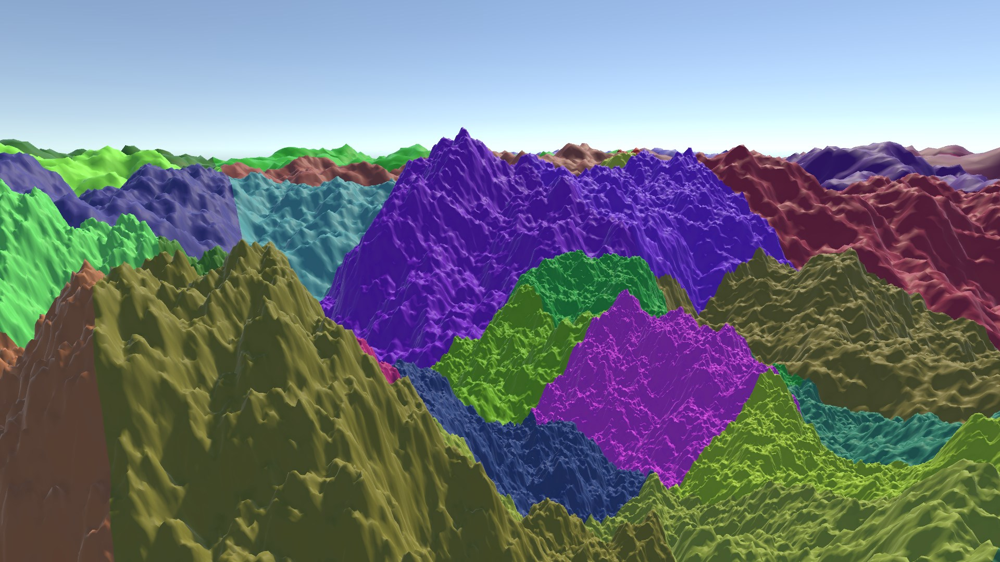
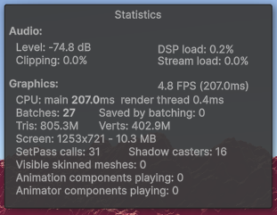
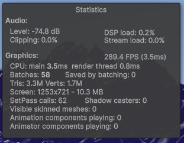

# QuadtreeTerrain

A procedural terrain generator using chunk pooling, mesh caching and a quadtree for a dynamic LOD, built using Unity Engine and C#. Visual clarity is maintained near the camera by keeping terrain chunks small and with a high vertex density, whereas far away chunks are kept large and with a low vertex density.

## Performance

No quadtree, frame time = 207ms 
 

With quadtree, frame time = 3.5ms 
 
